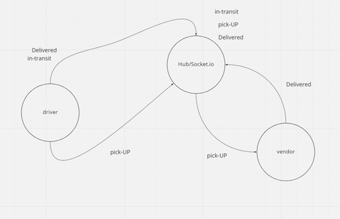

# caps

Created by Anthony Morton

## Installation
faker, jest, supertest, test,socket.io, socket.io-client

## Summary of Problem Domain
In Phase 2, we’ll be changing the underlying networking implementation of our CAPS system from using node events to using a library called socket.io so that we can do networked events. Socket.io manages the connection pool for us, makes broadcasting much easier to operate, and works well both on the terminal (between servers) and with web clients.

## User Stories
- As a vendor, I want to alert the system when I have a package to be picked up.
- As a driver, I want to be notified when there is a package to be delivered.
- As a driver, I want to alert the system when I have picked up a package and it is in transit.
- As a driver, I want to alert the system when a package has been delivered.
- As a vendor, I want to be notified when my package has been delivered.

## Links to application deployment
pull: https://github.com/anthonylouismorton/caps/pull/1
actions: https://github.com/anthonylouismorton/caps/actions

## Include embedded UML

